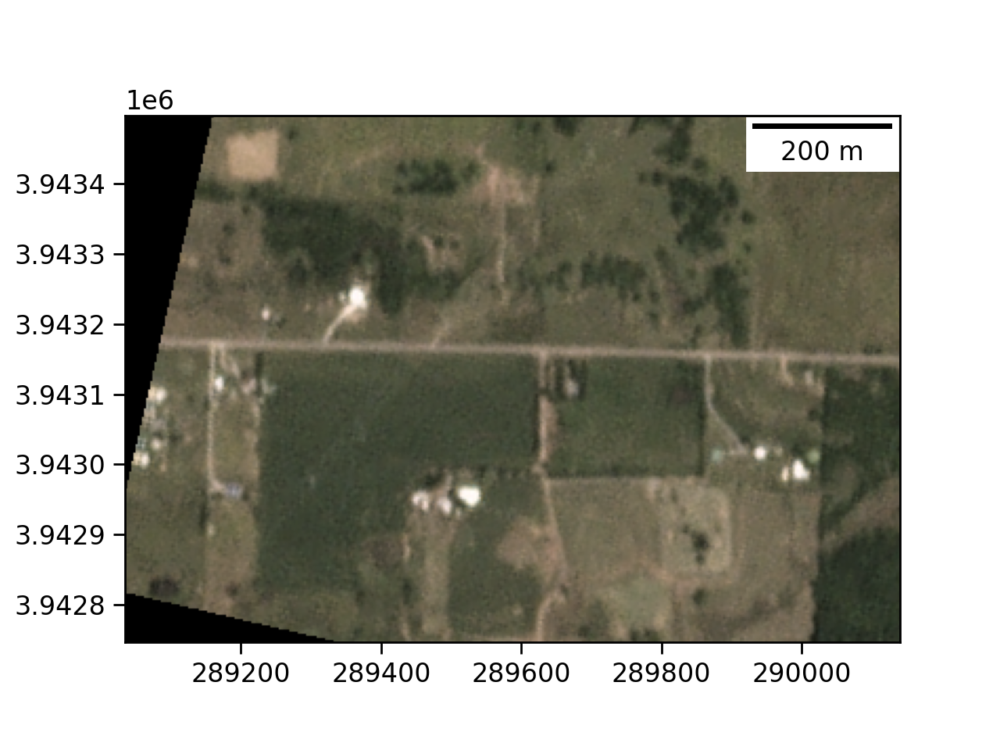

# SatMobFusion

##  A novel real-time event-identification methodology fusing satellite imagery with mobile sensor data

Rapid identification of breaking events and percolation of relevant information is of paramount importance, especially during life-threatening events like natural disasters. The prevalence of mobile devices and the ubiquity of network connectivity has generated a massive amount of temporally- and spatially-stamped data (called mobile data hereafter). Numerous studies have used mobile data to derive individual human mobility patterns for various applications (Gonzalez et al., 2008; Sulis et al., 2018; Edsberg Møllgaard et al., 2022). Similarly, the increasing number of orbital satellites has made it easier to gather high-resolution images capturing a snapshot of a geographical area in sub-daily temporal frequency (Ji et al., 2018, Fayne et al., 2016). We propose a novel data fusion methodology integrating satellite imagery with mobile data to identify breaking events in real-time. In the absence of boots on the ground, mobile data is able to give an approximation of human mobility, proximity to one another, and the built environment. On the other hand, satellite imagery can provide real-time visual information on physical changes to the built and natural environment. Our goal is to prototype a methodology that could be used in disaster relief when sufficient resources are available to pull together sub-daily, near real-time data to input in our framework.

**Objective**: Assess the extent to which high-resolution satellite imagery is a feasible alterantive or supplement to more established transportation data collection methods, such as cameras, crowdsourcing, and vehicle counters.

**Datasets**: 
* [Spectus Data](https://spectus.ai/): Passively-generated mobile data
* [Planet Data](https://www.planet.com/): High-resolution, high frequency satellite imagery

**Tools/packages**
* [Scikit Mobility](https://github.com/scikit-mobility/scikit-mobility): Library for human mobility analysis in Python
* [GPSImpute](https://github.com/ekinugurel/GPSImpute): Personal collection of convenience functions/ML tools for human mobility analysis
* [GeoPandas](https://geopandas.org/en/stable/): Library for geospatial data analysis in Python
* [Rasterio](https://rasterio.readthedocs.io/en/latest/intro.html): Raster data library for Python

## Methodology
Using mobile and satellite data, SatMobFusion is able to do extensive data cleaning and analysis to see what type of major-scale events can be identified and matched using both of our data sources across different geographies. In this demonstration project, the user can define an event of interest using the [configuration file](config/locations.csv).

This project assumed/replicated real-time availability of each dataset to gain an understanding of whether our proposed methodology leads to improvements in relevant variables, including emergency response times, information percolation speeds, etc. Beyond this scope, one could dig deeper into the context of our selected events, such as finding out about the availability of other data sources and the actual response time in order to benchmark our findings.

The idea behind our methodology is to use mobile data to identify anomalies in mobility metrics (e.g., visits per time unit) and then use satellite imagery to confirm the anomaly. The methodology is summarized in the following steps:

### Mobile data

#### Geographic partitioning

We have a few options in partionining mobile data spatially:
* __Option 1__: Call a free geocoding API (i.e. Nominatim) to get the relevant OpenStreetMap information. From here we can find the bounding box coordinates of a particular POI
* __Option 2__: Partition by federal and/or state designations, i.e. census tracts, zip codes, etc.
* __Option 3__: Type in a bounding box manually. For example, [geojson.io](https://geojson.io) could be a good option.
* __Option 4__: Obtain a KMZ file from the [Damage Assessment Toolkit](https://apps.dat.noaa.gov/stormdamage/damageviewer/>).

#### High-level steps

* Read data as a GeoDataFrame, project to CRS (we used UTM Zone 15)
* Exclude points outside of relevant geography (we excluded points outside OK)
* Filter out erroneous data points by maximum velocity (as the crow flies)
* Compress trajectory points by a spatial radius
* Define pre-, during-, and post-event periods
* Groupby variables of interest and check for anomalies

### Satellite data

#### Pull data

The following overview summarizes the steps to pull satellite data from Planet. The steps are outlined in more detail in the [pull_satellite_imagery.ipynb](pull_satellite_imagery.ipynb) notebook.

Here, the combined metric of area-of-interest (AOI) coverage and time difference to the event of interest was developed to identify the most suitable images before and after the event. The metric is designed in a way that makes a trade-off between how much of the AOI is covered by the satellite image and the time difference of when the satellite image was taken to the event of interest (see above). 25% (percentage points) more coverage of the AOI is worth as much as the image being taken 1 day earlier before the event or 1 day later after the event. This way, we identify one image before and one image after the event, that we can then compare.

#### Analyze data

The steps to analyze the downloaded satellite imagery are outlined in detail in the [analyze_satellite_imagery.ipynb](analyze_satellite_imagery.ipynb) notebook. On a high-level, the analysis looks at:
* The visible spectrum (RGB)
* A grayscale version (i.e. luminosity, derived from the RGB values)
* NDVI (Normalized Difference Vegetation Index, also derived from the RGB values)

## Case Study: Tornado in Tulsa, OK in May 2020
We analyzed the case of a tornado that ripped through an area south of Muskogee, a suburb of Tulsa, OK. We applied our methodological framework and determined that in a real-time situation, mobile data is able to pick up anomalies in certain mobility metrics (i.e., visits per time unit). After this, we determined the geographical extent of the anomaly and pulled in satellite imagery, for which anomalies were found as well. 

### Initial Results

We observe a clear spike in visits per hour in the geographical area of interest right after the hours of the tornado.

We can also see changes in the satellite imagery, see below:

**Satellite image before the event (May 9, 2020):**

**Satellite image after the event (May 18, 2020):**

The differences between the two images can best be understood when looking at difference maps between grayscale or NDVI (better) versions of the images before and after the event (i.e. `image_post - image_pre`, hence negative values signify reductions and positive values increases in the pixel value):

**NDVI difference map:** changes in red show areas where vegetation has been destroyed as a result of the tornado (magnitude is larger than NDVI gains, which are represented by green pixels)

**Grayscale difference image:** shows luminosity changes, which are mostly due to the destruction of vegetation

The [maps/](maps/) folder contains more maps highlighting the changes from before to after the tornado event.

### Expected Use Cases
Our proposed methodology is expected to outperform existing methods for data collection and information percolation for a range of use cases. We especially anticipate broad applicability in the following settings: events in rural areas, extreme-weather events, war-torn states, areas without network connectivity (i.e., for crowdsourcing), and national security matters.

### References
* González, M.C., Hidalgo, C.A., Barabási, A.-L., 2008. Understanding individual human mobility patterns. Nature 453, 779–782. https://doi.org/10.1038/nature06958
* Sulis, P., Manley, E., Zhong, C., Batty, M., 2018. Using mobility data as proxy for measuring urban vitality. Journal of Spatial Information Science 2018, 137–162. https://doi.org/10.5311/JOSIS.2018.16.384
* Edsberg Møllgaard, P., Lehmann, S., Alessandretti, L., 2021. Understanding components of mobility during the COVID-19 pandemic. Philosophical Transactions of the Royal Society A: Mathematical, Physical and Engineering Sciences 380, 20210118. https://doi.org/10.1098/rsta.2021.0118
* Ji, M., Liu, L., Buchroithner, M., 2018. Identifying Collapsed Buildings Using Post-Earthquake Satellite Imagery and Convolutional Neural Networks: A Case Study of the 2010 Haiti Earthquake. Remote Sensing 10, 1689. https://doi.org/10.3390/rs10111689
* Fayne, J., Bolten, J., Lakshmi, V., Ahamed, A., 2017. Optical and Physical Methods for Mapping Flooding with Satellite Imagery, in: Lakshmi, V. (Ed.), Remote Sensing of Hydrological Extremes, Springer Remote Sensing/Photogrammetry. Springer International Publishing, Cham, pp. 83–103. https://doi.org/10.1007/978-3-319-43744-6_5

## Contact
The authors can be contacted via email for any questions or help regarding this project.

+ Ekin Uğurel (ugurel [at] uw.edu)
+ Steffen Coenen (scoenen [at] uw.edu)

## Usage

The application was written in the Python programming language and used on the Python version 3.8.

## Licensing

See the [LICENSE](LICENSE) file for licensing information as it pertains to files in this repository.

## Documentation
Further documentation can be found in the code. Each function and most code blocks contain their own comments and documentation with descriptions of e.g. function parameters.
